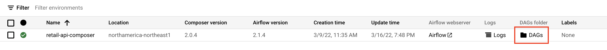
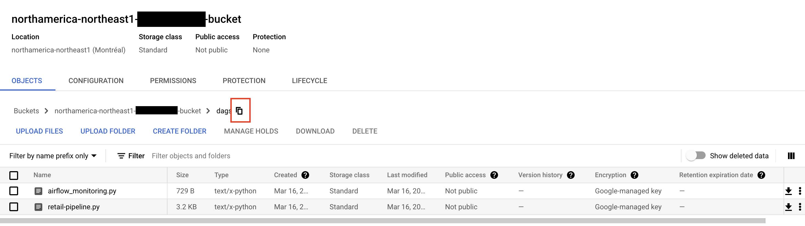

# Airflow DAG deployment

First get the DAG GCS buckets.
Go to Composer service in GCP console and find the DAG icon for your env


Then follow the link and retrieve the path to the GCS bucket


Now you can deploy the DAG using the command line:
```
gsutil cp retail-pipeline.py gs://<GCS BUCKET>
```

